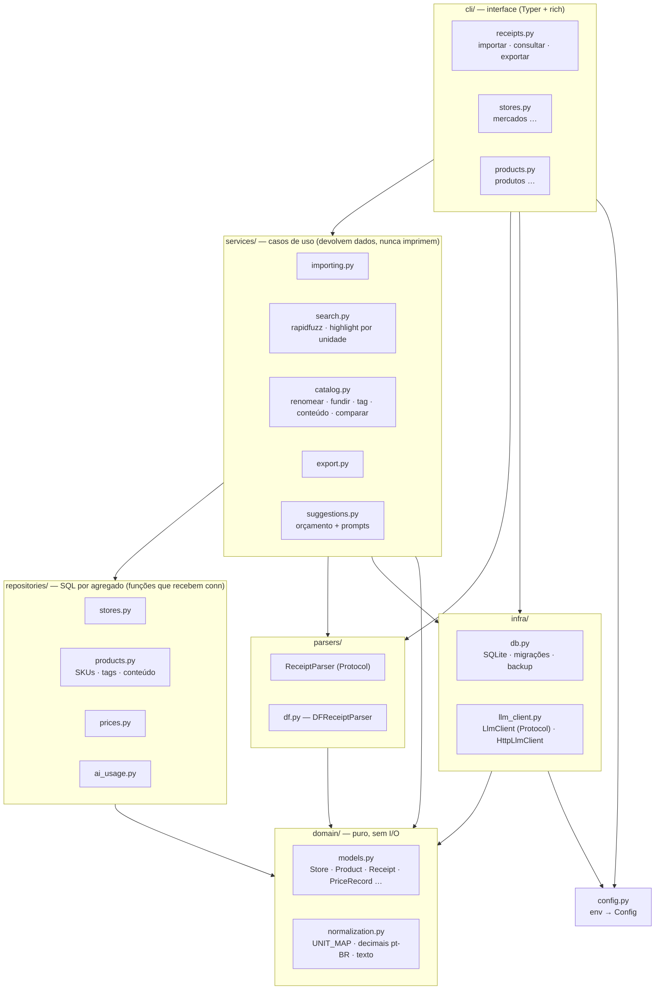
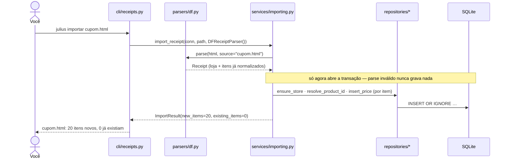

# Julius

> *"Banana a R$ 12 o quilo… tá caro?"*
> Julius lembra por você. Ele guarda cada preço que você já pagou no mercado — a partir do cupom fiscal — e responde essa pergunta na hora, mostrando onde e quando você pagou menos.

Nome em homenagem ao pai do Chris em *Todo Mundo Odeia o Chris*: o cara que sabe o preço de tudo e nunca deixa passar um centavo.

---

## Índice

1. [O que ele faz](#o-que-ele-faz)
2. [Em 60 segundos](#em-60-segundos)
3. [Como funciona](#como-funciona)
4. [Guia de uso](#guia-de-uso)
5. [Conceitos que valem a pena entender](#conceitos-que-valem-a-pena-entender)
6. [Configuração](#configuração)
7. [IA opcional (orçamento mensal)](#ia-opcional-orçamento-mensal)
8. [Arquitetura](#arquitetura)
9. [Banco de dados](#banco-de-dados)
10. [Desenvolvimento](#desenvolvimento)
11. [Limitações conhecidas e próximos passos](#limitações-conhecidas-e-próximos-passos)

---

## O que ele faz

Toda compra de mercado gera um cupom fiscal eletrônico (NFC-e) com um QR code. Esse QR code leva a uma página da Receita com **cada item, quantidade, unidade e preço**. Julius lê essa página, guarda tudo num banco local e deixa você consultar depois:

- **"Quanto eu já paguei por picanha?"** — histórico por data e por mercado, com o menor e o maior preço destacados.
- **"Esse pacote de 30 ovos vale mais que o de 20?"** — preço por unidade, litro ou quilo, quando você informa o tamanho da embalagem.
- **"Onde a banana estava mais barata?"** — cada mercado (e cada filial) tem um apelido que você escolhe.

O que ele **não** é: não compara mercados em geral, não controla orçamento, não dá veredito automático de "caro" ou "barato". Ele mostra o histórico; quem decide é você.

Funciona 100% offline, num arquivo SQLite no seu computador. Nada sai da sua máquina, a menos que você ligue a camada opcional de IA.

---

## Em 60 segundos

```bash
# 1. instalar (Python 3.10+ e pipx) — deixa o comando `julius` disponível em qualquer pasta
git clone <este-repo> && cd precos-dos-mercados
make install

# 2. importar um cupom (veja "Como pegar o HTML" abaixo)
julius importar ~/Downloads/cupom.html
#   cupom.html: 20 itens novos, 0 já existiam

# 3. perguntar
julius consultar tomate
```

Sem `pipx`? `python3 -m venv .venv && .venv/bin/pip install -e .` e use `.venv/bin/julius`.

```
                                Preços por KG
┏━━━━━━━━━━━━┳━━━━━━━━━━━━━━━━━━━━━━━━━━┳━━━━━━━━━━━━━━━━━━━━━━━━┳━━━━━━━━━━┓
┃ Data       ┃ Produto                  ┃ Mercado                ┃ Preço    ┃
┡━━━━━━━━━━━━╇━━━━━━━━━━━━━━━━━━━━━━━━━━╇━━━━━━━━━━━━━━━━━━━━━━━━╇━━━━━━━━━━┩
│ 2026-09-12 │ TOMATE ITALIANO UNIAO kg │ FL3 Costa Águas Claras │ R$ 11,89 │  ← verde
│ 2026-09-07 │ TOMATE ITALIANO kg       │ Dona de Casa Guará     │ R$ 14,99 │  ← vermelho
└────────────┴──────────────────────────┴────────────────────────┴──────────┘
                              Preços por UN
┏━━━━━━━━━━━━┳━━━━━━━━━━━━━━━━━━━━━━━━━━━┳━━━━━━━━━━━━━━━━━━━━┳━━━━━━━━━┓
┃ Data       ┃ Produto                   ┃ Mercado            ┃ Preço   ┃
┡━━━━━━━━━━━━╇━━━━━━━━━━━━━━━━━━━━━━━━━━━╇━━━━━━━━━━━━━━━━━━━━╇━━━━━━━━━┩
│ 2026-09-07 │ TOMATE TREBESCHI 250G DUO │ Dona de Casa Guará │ R$ 9,90 │
└────────────┴───────────────────────────┴────────────────────┴─────────┘
```

Tomate por quilo e tomate em bandeja nunca vão para a mesma tabela — e o menor e o maior preço de cada uma ficam destacados. Digitou errado? `julius consultar pcanha` acha picanha do mesmo jeito.

### Como pegar o HTML do cupom

1. Aponte a câmera para o QR code do cupom. Ele abre uma página da Receita (no DF: `ww1.receita.fazenda.df.gov.br/...`).
2. Passe pelo captcha, se aparecer.
3. No navegador, **Salvar página como…** → qualquer opção serve (só HTML ou página completa). Julius lê apenas o `.html`; a pasta `_files` que vem junto pode ser apagada.
4. Salve dentro de `entrada/`, na raiz do repo, e rode `julius importar` sem mais nada.

```bash
make inbox        # uma vez: cria entrada/ como atalho para ~/.local/share/julius/entrada
# Ctrl+S do navegador salvando em entrada/
julius importar   # importa tudo que está lá e arquiva cada arquivo importado
```

`entrada/` é um symlink para a pasta canônica em `~/.local/share/julius/entrada`, então o arquivo já cai no lugar certo — não há nada a mover depois. Cada arquivo importado com sucesso vai para `entrada/importados/<data>_<chave>.html` (renomear é obrigatório: o navegador salva toda nota como `qrcode.html`). A pasta de entrada fica limpa e a próxima varredura só vê o que é novo.

Por que não baixar direto pela URL? Porque a página passa por captcha — automatizar isso seria frágil e provavelmente contra os termos do site. Salvar o HTML leva cinco segundos e funciona sempre.

---

## Como funciona


Três ideias sustentam tudo:

1. **Importar é idempotente.** Cada linha do cupom tem uma chave única (`chave de acesso + posição do item`). Importar o mesmo arquivo duas vezes não duplica nada — só avisa "já existiam".
2. **Nada é adivinhado.** O parser lê o que está no HTML. Tamanho de embalagem, categoria e "esses dois produtos são a mesma coisa" são decisões suas, feitas por comandos explícitos. Onde a heurística erraria em silêncio, Julius prefere não fazer.
3. **Unidades nunca se misturam.** Preço por quilo e preço por unidade vivem em tabelas separadas na consulta. R$ 12/kg não é comparável com R$ 12 a unidade, e o sistema não finge que é.

---

## Guia de uso

Todos os comandos têm `--help`. Nomes em português porque são a interface; o código por baixo é em inglês.

### `importar` — trazer cupons para dentro

```bash
julius importar                                  # sem argumento: varre entrada/*.html
julius importar cupom1.html cupom2.html          # ou vários caminhos de uma vez
julius importar cupom.html --sim                 # não pergunta nada (nem o conteúdo que a IA não soube)
```

- Sem argumento, importa os `.html` da pasta de entrada (`entrada/`, veja `make inbox` acima). A varredura não é recursiva, então `entrada/importados/` fica invisível — é isso que faz `julius importar` significar "importe o que é novo".
- Reporta por arquivo: `cupom1.html: 20 itens novos, 0 já existiam · arquivado como 2026-09-12_5326….html`.
- **Arquivo importado com sucesso é movido** para `entrada/importados/`, com o caminho passado na mão também. Arquivo que falhou fica onde está, para você corrigir e tentar de novo. Se o arquivamento falhar, o aviso sai em `stderr` e o import continua valendo — o dado já está no banco.
- Se um arquivo falhar (não existe, HTML fora do formato, unidade desconhecida), imprime o erro em `stderr`, **continua os outros** e termina com código 1.
- Um arquivo com problema nunca grava nada, nem parcialmente — o parse acontece inteiro antes de qualquer escrita.
- Guarda também o endereço do mercado (impresso no cupom), pra aparecer depois em `mercados listar`/`consultar`.
- No fim, se algum item da nota bateu o menor ou o maior preço já pago do seu grupo, imprime o bloco `Nesta compra:` (no máximo 5 linhas). Nenhum recorde → não imprime nada.
- Com a IA configurada e produto novo na nota, roda a mesma revisão de `produtos revisar` (nome legível, categoria, conteúdo, tipo) uma vez, no fim — ver "IA opcional" abaixo. Sem IA, imprime só a dica de quantos produtos ficaram sem categoria.

### `consultar` — a pergunta principal

```bash
julius consultar banana                # por nome (parcial, tolera erro de digitação)
julius consultar hortifruti            # por categoria — sem precisar de --tag
julius consultar leite laticinio       # nome + categoria na mesma frase: interseção
julius consultar leite --tag laticinio # a forma explícita, se preferir (ou se a detecção errar)
julius consultar carnes --sem-tag      # força tratar "carnes" como nome, não como categoria
julius consultar arroz -n 5            # só as 5 compras mais recentes por unidade
```

- Uma tabela por unidade de venda (`KG`, `UN`), com a data e o **dia da semana** (`seg`…`dom`) de cada compra — só o dado, sem nenhuma afirmação sobre padrão semanal.
- Linhas mais recentes primeiro. A linha de **menor preço fica verde**, a de **maior fica vermelha** — e essas duas sempre aparecem, mesmo que sejam mais antigas que o `-n` pede.
- **Uma linha responde qual embalagem compensa**: quando o grupo é comparado por conteúdo, a tabela sai ordenada pelo preço por litro/quilo/unidade e termina com a frase — *"Mais barato por litro: Água mineral Indaiá 1,5L a R$ 2,46/L — contra R$ 3,58/L de Água Crystal com gás 500ml"*. Linhas idênticas (mesmo produto, dia, mercado e preço) aparecem uma vez só.
- **O destaque respeita a base de comparação**: por KG, o preço por quilo já é comparável; por UN, duas embalagens de tamanhos diferentes só se comparam pelo preço por conteúdo, e quem ainda não tem conteúdo definido fica **sem** destaque em vez de ganhar um destaque errado. É por isso que preencher conteúdo (ou deixar a IA preencher) vale tanto.
- A célula do mercado mostra o apelido e, embaixo em cinza, o endereço do cupom (quando já foi importado com endereço).
- Se o produto tem embalagem definida (veja `produtos definir-conteudo`), surge a coluna **Por L / Por KG / Por UN**.
- Uma palavra da frase que bater o nome de uma categoria (com tolerância a erro de digitação) vira filtro automaticamente, junto com o resto como nome — sem precisar de `--tag`. Se a interseção não achar nada, a busca tenta de novo pelo nome puro antes de desistir. `--sem-tag` desliga essa detecção pontualmente.
- Sem resultado por nome (e sem `--tag`): se a IA estiver configurada, tenta achar o produto por ela antes de desistir (ver "IA opcional"). Ainda sem nada: `Nenhum resultado.` — não uma tabela vazia.
- Toda chamada fica registrada em `~/.local/share/julius/query_log.jsonl` (uma linha por consulta) — histórico bruto pra ajustar o sistema mais pra frente, nenhum comando lê isso ainda.

### `mercados` — dar nome aos lugares

O cupom traz só a razão social ("FL 3 COSTA MULTICANAL S A"). Você quer ver "Atacadão Águas Claras".

```bash
julius mercados listar
julius mercados renomear 27.289.076/0013-79 "Atacadão Águas Claras"   # CNPJ formatado ou só dígitos
```

```bash
julius mercados comparar   # "esse mercado é mais caro?" — por grupo, com n e período
```

`mercados comparar` mostra uma tabela por grupo de comparação (veja `produtos tipo`), o mais barato em verde, depois "mais barato em 3 de 3 grupos" e sempre o rodapé com quantos grupos e de que período a resposta saiu. Esse rodapé não é enfeite: as notas de mercados diferentes podem estar a semanas de distância, e aí parte da diferença é o mês, não a loja. Nunca há um índice único de "mercado caro" — só a contagem por grupo.

`mercados listar` mostra também o **endereço** impresso no cupom (coluna própria). Filiais são CNPJs diferentes, e Julius as trata como mercados diferentes de propósito — os preços variam entre lojas da mesma rede. Vale pôr o bairro no apelido; se duas filiais da mesma rede ainda não têm apelido, o `importar` avisa com o endereço de cada uma.

### `produtos` — cuidar do catálogo

```bash
julius produtos listar                          # id, nome, conteúdo, tags
julius produtos renomear 14 "Suco de uva integral 1,5 L"
julius produtos tag 14 bebidas                  # categoria livre, minúscula
julius produtos tag 14 bebidas --remover        # desfaz a tag (nunca apaga a categoria em si)
julius produtos definir-conteudo 14 1.5 L       # L, ML, KG, G ou UN
julius produtos definir-conteudo 27 500 G       # gravado como 0,5 KG
julius produtos definir-conteudo 14 --remover    # desfaz o conteúdo
julius produtos tipo 14 suco                    # grupo de comparação entre mercados
julius produtos tipo 14 --remover               # desfaz o tipo
julius produtos comparar 14 31                  # "são a mesma coisa?" — só opina
julius produtos fundir 31 14                    # 31 passa a fazer parte de 14, que fica com o histórico
julius produtos desfundir 31                    # desfaz: 31 volta a ser separado, com tudo que era dele
julius produtos revisar                         # pede à IA nome/categoria/conteúdo/tipo dos pendentes
julius produtos revisar --sim                   # não pergunta nada; conteúdo sem resposta fica pendente
julius produtos revisar --ultimas-acoes         # o que a IA aplicou, com o comando pra desfazer
```

- **Nome**: nasce igual à descrição do primeiro cupom (`SUCO INT PARREIRAS DO SUL GF 1.5L UVA`). Renomeie quando cansar de ler abreviação, ou deixe a IA propor em `produtos revisar`.
- **Tag**: é o único jeito de agrupar por categoria. Busca por texto não sabe que "detergente" é "limpeza"; a tag sabe. `--remover` desfaz uma marcação errada (a categoria em si continua existindo pra outros produtos).
- **Conteúdo**: habilita a coluna de preço por litro/quilo/unidade. `G` e `ML` são convertidos para `KG` e `L` na hora de gravar, para todo o catálogo falar a mesma língua.
- **Fundir**: **reversível** desde a v2.4 — nada é apagado e nenhuma linha de preço muda de lugar; o produto absorvido só sai das listagens. Use quando o mesmo produto aparece com códigos diferentes em mercados diferentes, e `produtos desfundir ID` desfaz. Por ser reversível, não pede confirmação e imprime o comando de desfazer.
- **Comparar**: dá similaridade de texto e, se a IA estiver configurada, uma opinião. Nunca funde sozinho.
- **Tipo**: o grupo de comparação — "que tipo de coisa isso é" (`tomate`, `leite uht`). É o que faz `mercados comparar` e o sinal de preço do `importar` compararem entre lojas **sem fundir** produto nenhum. A IA propõe e grava sozinha; `--remover` desfaz, e a coluna "Tipo" em `produtos listar` mostra o que ela escolheu.
- **Revisar**: a tela de curadoria assistida por IA. Entra na fila todo produto a que falta **categoria, tipo ou conteúdo** — conteúdo só é cobrado de quem é vendido por UN, porque R$/kg já é preço por conteúdo. Nome legível, categoria, tipo e o conteúdo que estava escrito no rótulo são aplicados **sem perguntar** (tudo reversível por comando). A única pergunta é o conteúdo que a IA se recusou a afirmar: ela sugere valores plausíveis pelo costume do varejo (`[1] 10 UN · pacote`), você escolhe, digita ou pula com Enter — pular deixa o produto pendente para a próxima rodada, nunca marca "não tem conteúdo". `--sim` não pergunta nada. `--ultimas-acoes` lista o que foi aplicado, uma linha por campo, com o comando de desfazer pronto pra copiar. Ver "IA opcional".

### `exportar` — levar para a planilha

```bash
julius exportar                        # ./julius-export.csv
julius exportar -o ~/precos.csv
```

CSV com `;` como separador (o Excel em português abre direto), uma linha por item comprado, com apelido do mercado (e endereço, coluna `store_address`) e nome do produto já resolvidos. É uma cópia para leitura — o banco continua sendo a fonte da verdade.

### Corrigir um preço errado

Não há comando para isso, de propósito: é raro, e o `sqlite3` já vem instalado.

```bash
sqlite3 ~/.local/share/julius/prices.db
sqlite> UPDATE prices SET unit_price = 4.99 WHERE access_key = '5326…' AND item_index = 3;
```

---

## Conceitos que valem a pena entender

**Produto = código do produto *dentro de um mercado*.** O código `4134` é desengordurante numa loja e brócolis em outra — aconteceu de verdade nos cupons de teste. Por isso um produto novo é criado por par `(CNPJ, código)`, e o mesmo item recomprado no mesmo mercado sempre cai no mesmo produto. Juntar produtos de mercados diferentes é decisão sua (`fundir`).

**Por que a fusão não é automática.** Similaridade de texto acha que `SUCO … 1.5L UVA` e `SUCO … 1.5L LARANJA` são quase iguais. Sabor e tamanho são justamente o que muda o preço. Uma sugestão que erra isso ensinaria você a ignorá-la — então ela só aparece quando você pede (`comparar`).

**Por que o tamanho da embalagem não é lido da descrição.** `PRATO REDOND DESC 21CM` tem um número que é diâmetro. `CHA CX 16G C/10UN` pode ser 16 g o sachê ou a caixa. Um regex que acerta às vezes e erra em silêncio destruiria a confiança no número — e confiança é o produto inteiro.

**Códigos de unidade variam por rede.** `UN1`/`KG1` num mercado, `Un`/`Kg`/`PC`/`Gf` em outro. Julius traduz por um mapa curado (`PC` e `Gf` são "vendido inteiro", logo `UN`). Um código nunca visto **interrompe o import com erro claro** em vez de chutar — e a correção é uma linha em `julius/domain/normalization.py`.

**Duas datas no cupom.** "Emissão" é quando você comprou; "Data/Hora da Consulta" é quando você abriu a página. Só a primeira importa.

**O destaque é relativo à unidade, não ao produto.** Buscar "água" pode trazer água com gás e água mineral na mesma tabela `UN`; o verde e o vermelho marcam os extremos daquela tabela. Se quiser ver um produto só, seja mais específico no termo ou use tags.

---

## Configuração

Tudo por variável de ambiente. Sem nenhuma, Julius funciona com os padrões.

| Variável | Padrão | Para quê |
|---|---|---|
| `JULIUS_DB` | `~/.local/share/julius/prices.db` | Caminho do banco. Útil para experimentar com outro arquivo sem tocar no seu histórico. `ai_calls.jsonl` (log de IA) e `query_log.jsonl` (log de consultas) moram sempre ao lado. |
| `JULIUS_AI_API_KEY` | — | Liga a IA. Ausente = IA desligada, silenciosamente. |
| `JULIUS_AI_BASE_URL` | — | Endpoint compatível com `/chat/completions`. |
| `JULIUS_AI_MODEL` | — | Nome do modelo (testado com `deepseek-flash`). |
| `JULIUS_AI_BUDGET_USD` | `1.0` | Teto de gasto por mês. |
| `JULIUS_AI_INPUT_PRICE_USD_PER_1M` | — | Preço por milhão de tokens de entrada (obrigatório para a IA rodar). Recomendado usar o preço de **pico** do provedor, pra nunca subestimar o gasto (ex.: DeepSeek `0.30`). |
| `JULIUS_AI_OUTPUT_PRICE_USD_PER_1M` | — | Idem, saída (ex.: DeepSeek `1.20`). |
| `JULIUS_AI_REQUEST_EXTRAS` | `{}` | JSON mesclado no corpo do request, por cima de tudo — a válvula de escape pra peculiaridade de provedor. **DeepSeek precisa** de `'{"thinking":{"type":"disabled"}}'`: sem isso, `deepseek-flash` gasta todo o `max_tokens` "pensando" e nunca devolve o JSON pedido (medido no gate antes do primeiro ticket de IA). |

O banco e a pasta são criados no primeiro comando que precisa deles. Importar a CLI (ou rodar `--help`) não toca em disco — há teste garantindo isso.

---

## IA opcional (orçamento mensal)

Julius foi desenhado para custar zero. A IA existe pra fazer a curadoria que ninguém tem paciência de fazer na mão — e só grava o que dá pra desfazer com um comando; fusão de produto e preços nunca são tocados por ela:

| Situação | O que a IA faz | Quem grava / desfaz |
|---|---|---|
| Produto sem nome legível, categoria, tipo ou conteúdo | `produtos revisar` / `importar` chamam `enrich_products`: nome legível, a primeira categoria **já conhecida**, tipo e conteúdo **lido de rótulo inequívoco** são aplicados sem perguntar | Desfazer: `produtos renomear` / `produtos tag ID TAG --remover` / `produtos tipo ID --remover` / `produtos definir-conteudo ID --remover` |
| Produto vendido por UN cujo conteúdo a IA **recusou** afirmar | Uma segunda chamada (`suggest_packaging`) diz como o varejo brasileiro vende aquilo e oferece até 3 candidatos. Ela **nunca grava**: só vira opção numerada numa pergunta | você, escolhendo, digitando ou pulando; o que for gravado desfaz com `produtos definir-conteudo ID --remover` |
| `consultar` não achou nada por nome — nem puro, nem depois de descartar uma tag detectada no texto — e sem `--tag` explícito | Tenta achar pela IA (`match_products`) antes de desistir | Nada a desfazer — é só uma tentativa a mais na mesma busca; a dica sugere renomear/marcar pra achar direto na próxima |
| "Esses dois produtos são iguais?" | `produtos comparar` mostra a opinião dela | você, com `produtos fundir` (nunca automático) |
| Possíveis duplicatas encontradas na revisão | **Funde** o que ela confirma, diz o que fez e por quê, e pede pra você conferir | Desfazer: `produtos desfundir ID`, que a própria notificação imprime. Par com conteúdo declarado diferente nos dois lados nem chega a ser candidato |

**Como o teto vira realidade, não promessa:**

- A IA só roda em `consultar` quando a busca determinística **veio vazia** — nunca quando já achou algo. Em `importar`/`produtos revisar` roda para produtos novos/pendentes, não uma vez por busca.
- Cada *tentativa* de chamada (inclusive a que falhou ou veio truncada — pagou, conta) grava uma linha em `~/.local/share/julius/ai_calls.jsonl` (prompt, resposta crua, tokens, custo, erro) e soma o custo na tabela `ai_usage`, por mês. Antes de qualquer chamada, se o mês já bateu o orçamento, ela simplesmente não acontece.
- Sem os preços por token configurados, a IA não roda — não dá para debitar o que não se sabe medir.
- **Nenhuma falha de IA quebra nada.** Sem chave, sem rede, resposta malformada, orçamento estourado: tudo vira "sem sugestão" e o comando segue com o caminho determinístico. `produtos comparar` distingue as três razões (não configurada / orçamento esgotado / chamada falhou) em vez de uma mensagem só.

Testado com **DeepSeek** (`deepseek-flash`) — mas qualquer provedor que fale o formato `/chat/completions` serve, com uma ressalva real: se o modelo "raciocina" por padrão (thinking mode), configure `JULIUS_AI_REQUEST_EXTRAS` pra desligar isso, ou ele nunca converge (ver tabela de configuração acima).

---

## Arquitetura

Camadas com dependências em um só sentido — um grafo acíclico, checado por teste (`tests/test_architecture.py` falha se alguma camada importar o que não deve).



### O que cada camada pode e não pode

| Camada | Responsabilidade | Pode importar |
|---|---|---|
| `domain/` | Tipos imutáveis e regras puras (normalizar unidade, decimal, texto). Zero I/O. | só stdlib |
| `config.py` | Ler variáveis de ambiente para um `Config` imutável. | só stdlib |
| `infra/` | Falar com o mundo: arquivo SQLite, HTTP. | `domain`, `config` |
| `parsers/` | Transformar o HTML de um estado num `Receipt` já normalizado. | `domain` |
| `repositories/` | SQL de um agregado. Sem regra de negócio. | `domain` |
| `services/` | Casos de uso: orquestram parser + repositórios, aplicam as regras. | tudo acima |
| `cli/` | Traduzir argumentos em chamadas de serviço e dados em tabelas. É o *composition root*: o único lugar que instancia o parser e o cliente de IA concretos. | `services`, `parsers`, `infra`, `config`, `domain` |

### Decisões que explicam a forma do código

- **`Protocol` só onde há segunda implementação plausível**: `ReceiptParser` (outros estados virão) e `LlmClient` (testes trocam a rede por um fake). Repositórios e serviços são funções — a conexão SQLite *é* a injeção de dependência.
- **Um módulo por agregado / por caso de uso**, em vez de uma classe `Service` com quinze métodos. Cada funcionalidade nova toca um arquivo, não o mesmo arquivo de sempre.
- **Regras de negócio moram em `services/`.** "Nunca misturar UN com KG", "destacar menor e maior", "normalizar tag para minúsculas" — nada disso está no SQL nem na CLI.
- **Zero efeito colateral em import.** Nenhum módulo abre banco ou lê env ao ser importado; tudo acontece dentro do handler do comando.

### O caminho de um cupom



---

## Banco de dados

Um arquivo SQLite. Chaves estrangeiras ligadas em toda conexão (`PRAGMA foreign_keys = ON`) — o banco recusa um preço apontando para um mercado inexistente, em vez de o código ter que lembrar de checar.

| Tabela | O que guarda | Chave |
|---|---|---|
| `stores` | mercados: CNPJ, razão social, apelido | `cnpj` |
| `products` | catálogo: nome canônico, conteúdo da embalagem, tipo (grupo de comparação) | `id` |
| `product_skus` | qual código de qual mercado é qual produto | `(store_cnpj, product_code)` |
| `tags` / `product_tags` | categorias manuais | — |
| `prices` | **uma linha por item comprado**: data, mercado, produto, quantidade, unidade, preço | `(access_key, item_index)` |
| `ai_usage` | gasto de IA por mês | `month` |

A chave de `prices` é o que torna o import idempotente: `INSERT OR IGNORE` e pronto, sem consulta prévia.

### Migrações

O schema evolui por arquivos `julius/infra/migrations/000N_*.sql`, aplicados em ordem; a versão vigente fica no `PRAGMA user_version` do próprio arquivo. Isso roda em toda conexão:

- banco novo → cria tudo na versão atual;
- banco em dia → não faz nada;
- banco atrasado → **copia o arquivo para `prices.db.bak-vN` antes** de aplicar o que falta.

Adicionar uma migração é soltar um `.sql` novo na pasta. O backup é a rede de segurança real; nada apaga backups antigos por você.

---

## Desenvolvimento

```bash
make test        # cria o .venv/ na primeira vez e roda os 540 testes (~5 s)
make install     # `julius` global via pipx, em modo editável: editar o código já vale
make uninstall
```

Sem `make`: `python3 -m venv .venv && .venv/bin/pip install -e '.[dev]' && .venv/bin/pytest -q`.

Dependências: `typer`, `rich`, `rapidfuzz`. Dev: `pytest`. Nada mais — HTTP é `urllib`, CSV é `csv`, banco é `sqlite3`.

### Convenções

- **Código em inglês** (módulos, funções, variáveis, colunas SQL, env vars). **Português só no que o usuário lê** (nomes de comando, `--help`, mensagens, docs). Um comando `importar` chama uma função `import_receipts`.
- **Todo módulo com lógica nasce com teste de caminho feliz e triste.** Banco real em `tmp_path`, nunca mock de SQLite; rede sempre substituída por fake.
- **Comentário só para o porquê não óbvio.** Nada de narrar o que o código já diz.
- **Sem `NotImplementedError`.** O que não existe, não existe.

### Testes que valem conhecer

| Arquivo | Garante |
|---|---|
| `test_architecture.py` | as setas do diagrama de camadas — inspeciona imports de todo módulo |
| `test_cli.py` | `import julius.cli` não cria arquivo nenhum (roda em subprocesso) |
| `test_parser_df.py` | os 5 cupons reais em `tests/fixtures/` parseiam com contagens, datas e unidades exatas |
| `test_db.py` | FKs, `CHECK`s, PK de deduplicação e o backup antes de migrar (inclusive a migração 0002, contra um banco com dado de verdade) |
| `test_e2e.py` | os fluxos inteiros pela CLI, incluindo o caso "30 ovos por R$ 16,50 é mais barato por unidade que 20 por R$ 12,00" e os fluxos de IA (revisão, fallback de busca, endereço) com um `LlmClient` fake determinístico — nenhum teste toca a API real |

Fixtures são só o `.html` — nunca a pasta `_files/` que o navegador salva junto. Rede é sempre `tests/_fakes.py::ScriptedLlmClient`/`RaisingLlmClient`, nunca mockada teste a teste.

### Como estender

**Um novo código de unidade** (`LT`, `CX`…): uma linha em `UNIT_MAP`, `julius/domain/normalization.py`. O import vai ter falhado alto com o código exato na mensagem.

**Um novo estado**: implemente o `Protocol ReceiptParser` em `julius/parsers/<uf>.py` devolvendo um `Receipt` normalizado. Hoje a CLI instancia `DFReceiptParser` direto; escolher o parser pelo conteúdo do HTML é o próximo passo natural quando houver dois.

**Uma mudança de schema**: `julius/infra/migrations/0002_descricao.sql`. Nada mais a registrar.

**Um novo caso de uso**: função em `services/`, recebendo `conn` primeiro, devolvendo dataclasses de `domain/`. Depois um comando fino em `cli/` que só formata.

### Histórico do desenho

`CLAUDE.md` guarda o raciocínio completo — requisitos, cada decisão e cada alternativa rejeitada (por que SQLite e não CSV, por que `rapidfuzz` e não FTS5, por que não extrair conteúdo da descrição), além das pegadinhas encontradas nos cupons reais. `docs/tickets/julius-v1/` tem os 14 tickets que geraram o código, na ordem da DAG.

---

## Limitações conhecidas e próximos passos

**Hoje**

- Só o layout de NFC-e do **Distrito Federal**. Outros estados têm HTML diferente.
- Descrições vêm abreviadas do cupom (`LING FGO RESF AURORA kg`). A busca tolera erro de digitação, mas "linguiça" por extenso não acha `LING` direto — `julius produtos revisar` (com IA configurada) resolve isso de vez, propondo o nome legível; sem IA, renomeie manualmente os produtos que você consulta muito.
- Se a Receita mudar o layout da página, o parser quebra — com erro claro, não em silêncio, e os cupons reais em `tests/fixtures/` mostram exatamente o que mudou.
- Em `consultar`, empates no menor/maior preço mantêm todas as linhas empatadas mesmo fora do `-n`.
- A pasta `_files/` que o navegador salva junto do HTML ainda precisa ser apagada à mão: a função existe e está testada, mas apagar é a única operação destrutiva do sistema e está esperando decisão explícita.
- `mercados comparar` só enxerga grupos comprados em dois mercados; sem tipo atribuído, não há o que comparar.
- Sem cache de respostas de IA (de propósito — a solução durável é corrigir o dado, não lembrar a resposta antiga).

**Evoluções plausíveis** (nenhuma prometida)

- Parsers para outros estados, com seleção automática pelo HTML.
- Um bot (Telegram) recebendo o HTML e chamando os mesmos serviços — a CLI foi feita para ser *uma* interface, não a única.
